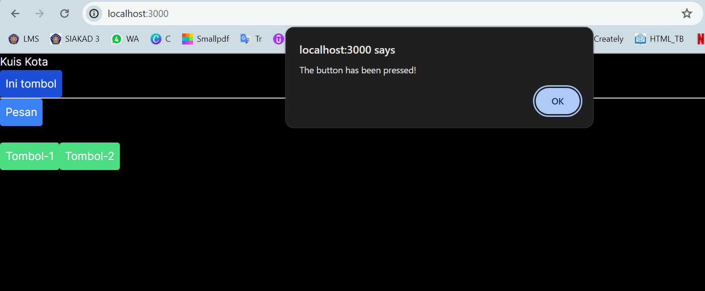
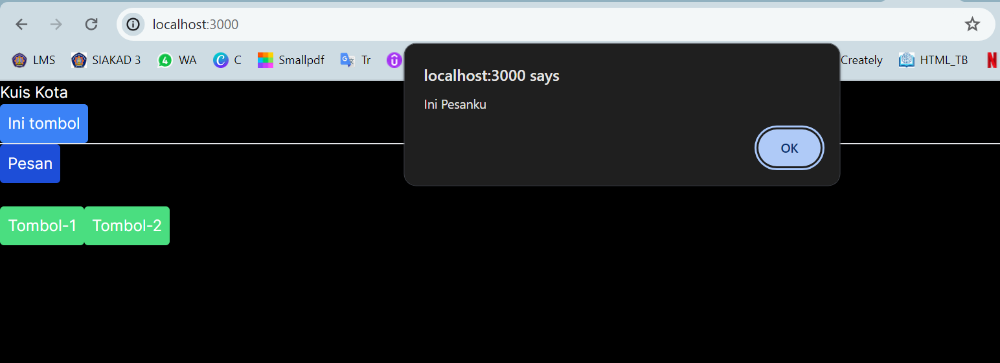
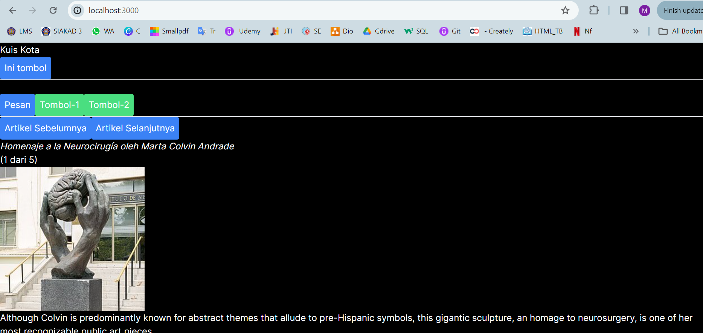
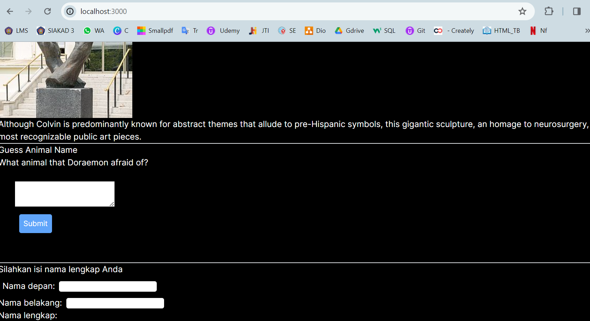

## Laporan Praktikum

|  | Pemrograman Berbasis Framework 2024 |
|--|--|
| NIM |  2141720269|
| Nama |  Muhammad Asad |
| Kelas | TI - 3I |

## Question 1,2
What is the difference between the Form_2first function and the second?
Why do you need to delete state fullName? What are the advantages?
## ANswer
Form is a game-related form, while Form2 deals with capturing and displaying user names. Deleting the fullName state in Form2 streamlines the component and improves efficiency.

## Question 3,4
What is the purpose of this writing key={to.email}?< Chat key={to.email} contact={to} / >
What is the function of keythese props?
## Answer
The key prop in React is a special attribute used to give elements a stable identity during dynamic changes. In the <Chat key={to.email} contact={to} /> component, it helps React identify which Chat component to update when the selected contact changes, improving performance by avoiding unnecessary re-renders. Essentially, it’s a tool for React to efficiently manage lists and UI state transitions.