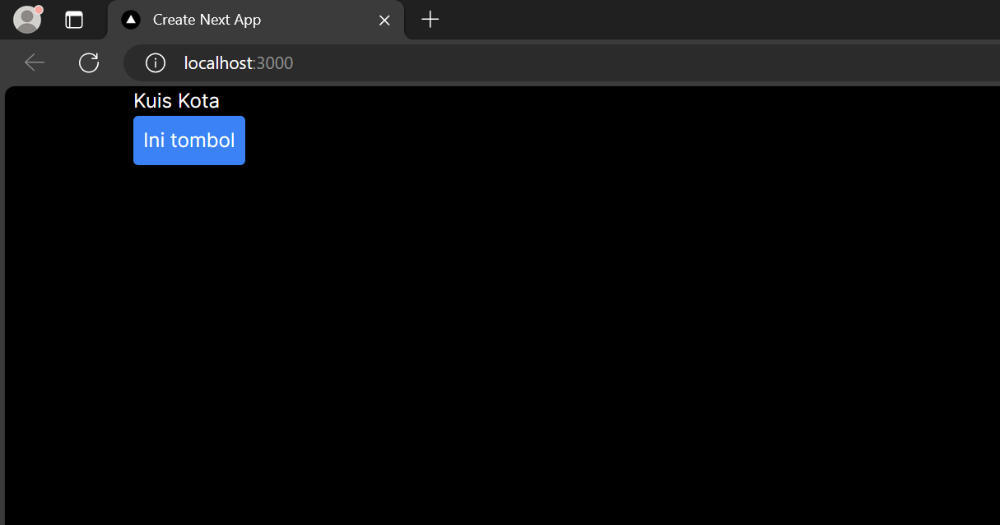
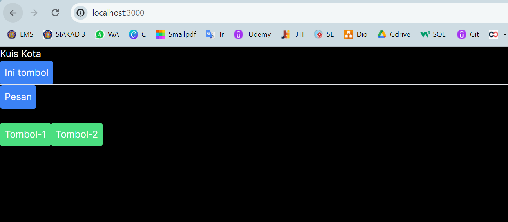

## Laporan Praktikum

|  | Pemrograman Berbasis Framework 2024 |
|--|--|
| NIM |  2141720269|
| Nama |  Muhammad Asad |
| Kelas | TI - 3I |

### Question 1
Change the contents of the code Home()so that it can appear as follows by utilizing the components Profile()that were created in step 1!

## Question 2
Capture the results and create a report in README.md . Explain what you have learned and how does it look now?